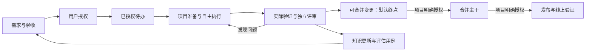

# LazyZCode 0.3.0：Agent-first 工程工作流改造方案

日期：2026-09-23。状态：**共识已确认；用户明确要求本会话不进入实施，交接另一会话**。
基线：`fb61809`，包版本 0.2.3；已有 Unreleased workers 与债清改动不作为本轮新成果。
依据：[访谈十项决策](design-v030-agent-first.md)、[一手研究与差距](research-agent-first-v030.md)、领域术语（`CONTEXT.md`，仓根非站点页）。

## 1. 交付目标

让用户批准需求、验收与权限后，代理能准备项目、自主规划和实现、观察运行结果、修复失败、
独立评审并交付可信变更；经明确授权，还能连续处理待办、合并主干及发布到指定 Web 环境。
以 lazyzcode、openchamber、zpigeon-ios 三仓验证完整路径。

成功由可观察结果定义：任务真正达到约定终点，证据对应实际被测版本，越权或验证不明时不冒充完成，
中断后能够恢复，任务切换不能重置累计预算。角色数量、运行时长、提交数量都不是成功指标。

交付 A 不要求真的合入主干。工人变更整合后的候选版本必须验证；B/C 再承担各自外部动作和后续验证。
这是 ZCode 插件与轻量 CLI 的演进，不新增跨宿主产品、模型路由、常驻调度服务或通用 CI/CD 平台。
保留零遥测、宿主配置零写入、Stop 预算预留、Node >=22 与根包零新增依赖。

## 2. 六项核心能力

| 能力 | 0.3.0 产物 | 对应现有资产 |
| --- | --- | --- |
| 明确需求与授权 | 可版本化需求契约、可信批准/撤回、独立的执行计划 | plan snapshot、UPS 人权门、attempt 世系 |
| 让项目可开发、可观察 | 项目能力清单、启动/检查/观测/清理配方、就绪诊断 | init-deep、doctor、项目现有工具 |
| 让知识可检索 | 简短入口、领域文档索引、现行约束与历史分离、链接/体积检查 | AGENTS、ADR、skills、已有索引 |
| 让验证可执行、证据可复用 | 验收项到检查的映射、执行回执、依赖指纹、独立评审 | DAG、红绿证据、comparator、attestation |
| 有界连续执行 | 已授权队列、累计预算、恢复和明确阻塞原因 | drive、lease/fence、handoff、单次预算 |
| 有限交付与持续改善 | 一个 GitHub 合并面、一个 Pages 发布面、回归评估集 | CI、发布清单、findings/ablation 账本 |

## 3. 领域对象与权威边界

本节为工程设计提案。用户已确认方向，字段和状态选择随本方案一起评审。

### 3.1 需求契约与执行计划分离

需求契约包含：任务身份、问题与非目标、稳定的验收项 id、允许修改的仓库/路径、能力与风险边界、
交付终点、项目配方版本、预算授权引用。序列化后的完整内容形成不可变 `contractHash`。
执行计划另有自己的快照、哈希、步骤依赖和 attempt 世系；它只决定如何履约。

- UPS 继续作为可信用户事件入口，批准绑定契约完整哈希，短码仅供显示与输入；不得增设模型自批命令。
- 同一契约内调整步骤、拆分任务内部实现、修复失败和更新计划，无须重新向用户索取批准。
- 验收项删除/放宽、非目标改变、写入范围扩大、交付级别提高、配方权限改变或追加总预算，都形成新授权请求。
- 契约未变不代表实现符合契约：验收执行、独立评审和越界检查仍负责发现实现偏离。
- 批准、撤回、替代记录追加保存。派发前、检查/交付配方启动前复核有效授权；撤回后停止后续动作。
- 撤回不声称能撤销已经发生的外部效果；进入执行的动作按其结果核对协议收束。

本地同权限进程可改写文件，worktree 也不是权限沙箱。沿现有威胁边界，机器保证 lzy 管理路径的状态与授权核对，
不宣称可以阻止同权限恶意代理绕开 lzy 执行原生命令。B/C 凭据与宿主工具权限仍由用户和外部系统管理。

### 3.2 项目能力清单

建议使用根级 **`lzy.project.json`** 作为随仓库版本化的配方清单，使用 JSON 避免引入解析依赖。
它与运行时 `.lazyzcode/` 分离，记录工具入口而不嵌入凭据。

清单分为 `prepare`、`start`、`check`、`observe`、`cleanup`、`delivery` 六类能力；每个配方至少有
稳定 id、执行 argv、cwd、超时、所需环境变量名称、允许写入位置、输出与验证依赖声明。
只读发现命令列出缺失项；生成的清单与项目文档先展示差异，采纳后才能作为受信执行输入。

执行采用明确的程序与 argv，`shell:false`；复杂操作指向项目拥有的脚本，不生成任意命令字符串解释器。
配方内容变化使绑定该配方的授权/证据重新评估。环境就绪检查必须区分“存在入口”和“实际可运行”。
端口、临时目录、进程和模拟器测试数据按运行隔离；清理仅处理该运行登记拥有的资源。
缺凭据、缺兄弟依赖或缺平台工具时报告具体阻塞，不能换成另一个容易通过的验证面。

### 3.3 知识和技能组织

AGENTS 保留产品定位、不可违反的约束、常用入口和路由；历史沿革迁入历史文档，领域规则各有唯一来源。
zw 成为简短入口，按阶段加载需求、执行、验证、交付和恢复配方，不再每次注入全部规则。
首版建议体积预算：根入口 <=12 KiB，zw 常驻入口 <=8 KiB；仍保留分层文件的行数诊断。
这是预算提案，不以删规则达标：迁出内容须可从入口发现，并用任务检索测试证明没有丢失约束。

文档巡检检查链接、失效指针、现行/历史标记和声明的检查入口。语义漂移先出工作提案，
不借“自我改进”修改当前授权、放宽验收或自动移除门禁。已授权修复中的知识与回归用例更新属于该修复交付。

## 4. 实际验证与证据复用

### 4.1 执行回执成为主要证据入口

每个验收项引用一个或多个检查配方。受控执行器记录 `runId/checkId/acceptanceId`、契约哈希、候选版本、
配方摘要、输入指纹、环境指纹、开始/结束、退出结果和输出工件 sha256；原始结果与人工摘要分开保存。
新回执由真实执行产生，不能用一段文本或更新指纹冒充新执行。

截图、视频、浏览器或模拟器观察仍可作为外部表面证据，标明执行来源及实际被测产物；
不能运行的面记录为 blocked。语义证据仍由独立评价者判断其是否证明验收，机器回执不取代语义判断。
红绿默认保留；合理豁免须有原因和复核。针对故障修复，红绿检查程序与受测条件应具有可解释的对应关系。

### 4.2 两档依赖策略

1. **保守全树档（默认）**：项目未建立可靠验证依赖时，沿用 {host}+subjects 全树指纹，并纳入配方与环境身份。
2. **受验证的范围档**：项目检查配方提供经审查和对抗测试的依赖清单或工具生成输入清单，包含应用源码、
   验证程序、构建/依赖配置、使用的数据和环境条件。只有清单覆盖且未发生相关变化才允许复用。

清单缺失/损坏、未知新文件、动态输入不可界定、路径逃逸、环境变化无法解释，均回退全树或重新执行该检查。
禁止仅由“排除 tests/docs”之类宽泛规则获得复用资格；验证脚本或锁文件变更不是默认无关。
范围资格属于具体配方及其版本，不授予整个项目永久豁免。首版只武装三仓中真正证明过的配方，其余保持保守。

复用保留原执行时间和原观察事实，并追加适用性判定，不改写旧回执。独立评审覆盖契约、代码、
依赖范围变化与实际结果；评审也绑定候选身份。候选变化后相关评审/CI 结果要重新核对。

### 4.3 整合与最终验证

工人分支先整合为可审查候选，再执行整合检查和用户路径冒烟；不能以各工人独立成功替代整合成功。
当前 `core/drive.js` workers 波末只调用 `step done --evidence` 重锚的路径必须退役，换成真实检查执行。
交付 A 的必要条件为：验收项均有适用证据、独立评审无阻塞、声明的 CI 检查通过、候选身份一致。
没有远端 CI 的项目可先产出本地已验证候选，但不能把 CI 缺席说成“可合并变更”；试点补齐对应检查能力。

## 5. 队列、恢复与预算

### 5.1 最小状态规则

待办条目：`proposed → authorized → ready → running → completed`；分支为 `blocked/failed/cancelled`。
`completed` 必须注明达到 A/B/C 哪个约定终点。未知外部结果进入单独的待核对状态，不归 completed。
ready 要同时满足契约授权有效、依赖完成、项目就绪、预算可用和工作区可取得租约。

首版同一宿主默认只执行一个目标；队列按显式顺序和依赖取 ready 项，独立项目可各自运行。
步级并行沿现有 worktree/claim 能力，按任务可分性与实测收益开启，不以更高工人数作为默认优化。
自动重试仅针对已分类的暂时性错误，最多 2 次且计入原授权预算；逻辑失败先修复，不无限重复相同输入。
失败项阻塞其依赖项，独立 ready 项可继续；授权/预算/共享环境损坏则停止该授权批次派发。

继续使用现有 loop 作为单个活跃执行面的状态，队列保存待办引用与派发登记，不建立第二份可任意修改的活跃目标权威。
取队列项、绑定 goal 和租约使用带事务 id 的派发记录；崩溃后先核对记录与现行 goal，不能重复启动或 reset 另一目标。
完成归档和队列确认之后才能腾出当前槽位。取消保留工件与历史，不自动清理用户改动。

### 5.2 授权预算

预算账本放在 `.lazyzcode/` 中独立于可 reset 的当前 goal，绑定授权 id；追加额度也是带来源的新授权记录。
单次运行与队列总额同时约束派发，换任务、重启、重试、重取证和交付检查均不重置累计值。
调度前在锁内登记资源占用，结束后核销；相同运行回执不能重复扣账，崩溃时未结算占用不能当作零消耗释放。

累计执行时长按受控运行/配方的实际执行时间计入；并行工人分别累计，单次墙钟另有截止时限。
等待人工与宿主休眠不算执行时长。实际超额仍如实记账，不能为保住阈值而拒写已发生消耗。

**积分边界必须诚实**：现有 headless 只有结束摘要，usage 可能缺席；本代无 `--max-turns`；
现有成本归因还含时间窗/目录启发式。因此本轮没有证据证明能保证“正在运行的模型请求绝不产生额度外积分”。
M0 必须探明逐运行归因、延迟和可中止边界：

- 可计量时累计真实用量，达到限额立即停止后续派发；明确记录在途超额和观测延迟。
- 计量缺席、未知模型价格、未决占用或归因不清时，不把它算成零；停止受积分限额约束的自动派发。
- Q10 已批准预算上限，不能在实现时单方面改成只有事后记账。M0 必须给出满足该语义的能力判定；
  若缺少能约束实际消耗的执行前额度保留/硬限制机制，事后统计和停止下一次派发只算诊断能力，
  不足以使累计积分硬顶验收通过，必须阻塞相应 M3 及发布验收。
  不以墙钟限额替代积分承诺，不自动改成无限预算；若只能实现带在途超额的近似限制，作为范围变更重新交用户决定。

唤起仍归宿主；队列负责醒来后做哪些已授权工作，不新增定时器或写宿主调度数据库。

## 6. B/C 的首条交付链

已确认采用以下存在且可读核验的目标作为首条交付链；具体外部操作仍需对应授权：

| 面 | 固定候选 | 已查证事实 | 终验 |
| --- | --- | --- | --- |
| B | `Acfufu/lazyzcode`，PR → `main` | 仓库默认 main；`allow_auto_merge=false`；当前身份可 push/admin | 正常 merge 绑定 PR HEAD；读回实际 merge SHA，并等待该 SHA 的必需 CI/整合验证通过 |
| C | 同仓 GitHub Pages，`main:/docs` → `https://acfufu.github.io/lazyzcode/` | API 返回 build_type=legacy、status=built、source=main:/docs | 发布构建对应提交 + HTTPS 实际内容/版本标识 + 浏览器关键路径均匹配 |

这是 Pages 静态 Web 发布支持，不宣称已经支持 openchamber 服务部署、npm 2FA 发布或 App Store 分发。
openchamber 仍是完整 Web 开发验收项目，C 使用既有网站发布面，不虚构它当前没有核实的线上设施。

**自动副作用在动作前授权**：该仓 main 是 Pages 发布源，首条试点保守视为合并会触发部署，
因此在合并前取得明确的 B+C 授权，分别记录 B 与 C 的结果。只有 B 授权时，该链拒绝合并，
不能等 Pages 已发布再补要 C 授权。一般项目也要识别 push/merge 触发的自动发布；副作用不明时不放行。

仓库未开 GitHub auto-merge 不阻止代理在检查通过后执行正常合并；首版不修改仓库设置，也不使用 admin 绕过保护。
`gh pr merge --match-head-commit` 已从本机帮助核实，实际合并仍需授权中明确 repo/base/策略和已检查的提交。
若 base 或 PR HEAD 在检查后变化，重建候选并复核适用验证，不能拿旧 CI 结果合并新提交。
合并后使用实际 merge SHA 的检查结果，不能复用 PR HEAD 的绿色标记冒充；若实际合入后验证失败，
状态为“已合并、验证失败”，外部事实保留，任务不得标记 B completed。

动作先记录意图和目标身份，再调用外部工具，随后读回核对；超时/断连记录为结果未知。
恢复先查询 PR 是否已合并、Pages 是否已部署指定提交，不直接再发一次写命令。
本地日志不能保证远端 exactly-once；只承诺首条已测试链的幂等核对。回滚仅在项目授权明确涵盖且已验证时执行，
否则报告真实状态并交接。执行阶段的具体文档变更、PR 和外部写入须形成可审查工件并得到对应授权。

## 7. 模块与存储改造

| 面 | 建议责任 | 演进方式 |
| --- | --- | --- |
| `core/contract.js`（新增） | 契约快照、有效授权/撤回与权限判定 | 从 loop/trigger 中抽出批准对象逻辑，保留可信事件来源 |
| `core/project.js`（新增） | 项目清单、配方校验、就绪发现 | 复用 agentsmd/doctor；不引入框架管理器 |
| `core/verify.js`（新增） | 配方执行、回执、依赖指纹及复用判断 | dag/attest 持续承载证据关系与终验归档 |
| `core/queue.js`（新增） | 待办、派发恢复、授权总预算引用 | runtime 继续负责 lease/fence/预算原语，drive 负责一次执行 |
| `core/delivery.js`（新增） | 首版 GitHub/Pages 动作与读回核对 | 字面量 argv、明确超时；复用用户已有 gh/Git/CI |
| `core/loop.js`、CLI | 活跃任务生命周期与兼容入口 | 逐步委托上述职责，不先做大规模模块重写 |
| 插件 skills/agents/hooks | 路由、探索、实现、独立评价和可信事件 | 常驻提示缩短，CLI 可做的确定性检查不交给模型 |

新机器记录带 schemaVersion、稳定身份及完整性校验，继续使用 Node 原语与原子文件写入。
契约、授权、回执、交付意图与累计预算均在 `.lazyzcode/` 下独立家族保存；reset 当前目标不能删除它们。
新字段先加契约测试和错误读面，再切换权威，避免双写两套可独立修改的“完成状态”。
建议 CLI 组织为 `project`、`task`、`queue`、`verify`、`delivery`，保留 status/doctor/history 读面；
`loop/step` 旧入口只在有明确映射时转接，不能兼容性放宽新门。CLI 不提供自批权限或静默跳过验证的逃生旗标。

## 8. 迁移

显式运行迁移：先只读预览，再对源状态做校验备份和新状态暂存，校验成功后原子切换版本入口。
迁移按任务身份幂等，崩溃可从日志恢复；失败保留源状态及诊断，不要求用户手改 JSON。

- 已完成目标和旧 attestation 原样保留，以旧版本语义读取；不伪造新回执或新的 B/C 完成。
- 在途目标保留计划、工件和证据，转换出待确认的需求契约；旧 planHash 批准不能升级成新任务/队列/交付权限。
- 旧全树证据继续按原绑定解释；获得范围复用资格必须重新建立对应验证配方与证据。
- 活跃 lease/进程在场时拒绝写迁移；未知 schema、损坏源和不完整备份均停止切换。
- schema 切换前可原路退出；新格式已产生新工作后，不宣称旧二进制可以直接接管，恢复使用明确的只读导出/迁移工具。

## 9. 三仓试点任务与入口

以下是具体可审查的基准任务提案，不把受控缺陷说成现有产品故障。隔离现场冻结版本、依赖和输入，
采用旧版与 0.3.0 同条件对照；三仓的主工作树和用户数据不承担注入缺陷的试验。
驱动流程使用候选 0.3.0，修复对象是冻结的基准仓副本；两者路径和 CLI 版本分开记录，避免自举混淆。

| 项目 | 基准任务 | 已核对的入口 | 实际表面与限制 |
| --- | --- | --- | --- |
| lazyzcode，M2 | 在冻结基准仓的隔离夹具中破坏 `drive --workers 0` 的非法参数拒绝行为，修复为非零退出且不启动工人；单任务中断后恢复并交付 A | `node cli/lzy.js loop drive --workers 0`、`node cli/lzy.js --help`；当前 `core/drive.js` 的 workers 参数入口和 `test/drive.contract.test.js` | CLI stdout/退出状态、零启动副作用、真实引擎续跑；非法参数检查须在环境/目标前置条件之前观察到，不以另一错误冒充红绿 |
| lazyzcode，M3 | 队列完成第一项后中断，重启继续第二项；故障场景不得刷新预算或重复交付 | 新队列入口及累计账本；已有 `scripts/headless/e2e-drive.mjs` 提供单次驱动基座 | 队列专属验收只在 M3 开始，不作为 M2 单任务完成的前提；假引擎用例与真实引擎结果分列 |
| openchamber | 在隔离回归夹具中破坏一项设置搜索映射，要求修复 `scrollbar` 查询到外观设置的流程，并在浏览器实际打开对应设置 | `bun run build:web`、`node packages/web/bin/cli.js serve --port 4173 --foreground`；`bun test packages/ui/src/lib/settings/search.test.ts`；`bun run type-check:ui`、`bun run lint:ui` | `search.test.ts` 已存在 scrollbar 用例；浏览器操作不能由纯函数测试替代；执行时先按项目规范准备隔离实例与 OpenCode 依赖 |
| zpigeon-ios | 在隔离回归夹具中破坏工作区卡片展开/收起，要求修复并实际展示行列表变化，随后重启恢复测试现场 | `scripts/dev-setup.sh`、`xcodegen generate`；`xcodebuild -project ZPigeon.xcodeproj -scheme ZPigeon -destination 'platform=iOS Simulator,name=iPhone 17' build`；UI 测试入口 `ZCodeWebParitySmokeUITests/testSmokeWorkspaceCardExpandCollapse` | 需要 Xcode/iOS 26、兄弟 `../zpigeon/Packages/ZCodeKit`、专用模拟器配对和带任务的数据；现有测试含时间等待/空态分支，不能直接当成确定性完整验收 |

原生试点须把配对和测试数据准备成可复现场景，使用独立模拟器，机密通过运行环境注入，证据脱敏；
缺配对不能跳过后报绿。新验收等待具体 UI 状态/事件，不照搬现有固定 sleep。
openchamber 的规则限制未经明确请求的 Git 操作；试点契约须明确其隔离 checkout/Git 权限，不能用本仓授权暗中覆盖。
本轮只读取项目文件与远端元数据，尚未执行这些构建、应用或真实引擎验收。

## 10. 分六阶段实施

阶段按依赖顺序推进，每个阶段先保护现有行为，再交付一条可运行路径；不同时启动全模块重构。

| 阶段 | 可交付结果 | 主要工作与验证 | 出口 |
| --- | --- | --- | --- |
| M0：能力与基线 | 三仓可重复的试验定义、宿主能力报告、迁移样本 | 钉工具版本/任务快照；探积分归因与延迟、可信批准/撤回、浏览器/模拟器回执；为已观察 workers 重锚路径建立反例 | 可重复红面与基线在案；未知能力有明确阻塞影响，尤其积分硬顶不得靠假设通过 |
| M1：项目与授权 | 一个项目从接入到授权执行，计划可自主调整 | project/contract、UPS、知识路由；迁移预览与旧记录只读；越界/撤回/配方变更反例 | 同契约改计划可继续；扩大权限拒绝；入口信息体积下降且必需规则可找到 |
| M2：单任务 A | 需求 → 实现 → 实测 → 独立评审 → 可合并候选 | verify 回执、范围档、整合验证、CI 身份绑定；开始三仓实际试点 | 三仓 A 均能完成；错误复用和伪重锚被拒；动态依赖不明确实回退 |
| M3：有界队列 | 多项已授权工作跨中断连续完成 | queue、累计预算、派发恢复、失败依赖处理；断电/重启/重复消息/计量缺席矩阵 | 无重复派发、无预算刷新、无未授权新工作；未决消耗不能假零 |
| M4：有限 B/C | GitHub 合并与 Pages 发布真实闭环 | 合并 HEAD 核对、外部意图/读回、部署提交与线上内容核验 | 一条 B 和一条 C 真实通过，断连未知结果可核对且不会盲目重复写入 |
| M5：迁移与发布收口 | 三仓回归报告、升级工具、文档与发布候选 | 迁移写入/故障恢复；打包/缓存一致；跨平台 CLI 测试与支持边界；最终独立审查 | 发布验收全部有证据；未达条件明确阻塞，不把预留接口算完成功能 |

M0 若发现无法履行某项承诺，允许继续不依赖它的阶段，但须在改动相关已拍板范围前重新取得用户决定。
定版、tag、Release、npm publish 与外部试点写入仍须按对应授权执行；本次规划确认不是发布指令。

## 11. 发布验收矩阵

| 编号 | 必须观察到的行为 |
| --- | --- |
| V01 | 契约内重规划不请求新批准；删验收、扩路径、提升终点、改权限配方均拒绝沿用旧授权 |
| V02 | 撤回对尚未派发/下一受控动作生效；已发生外部效果如实记录而非假称撤销 |
| V03 | 三仓环境缺失分别可诊断；CLI、浏览器、模拟器各自实际观察到目标结果 |
| V04 | 原始回执不可由摘要替代；候选/程序/输入身份不符不得当作当前有效证据 |
| V05 | 无关变更确实复用；验证脚本、锁文件、共享配置、动态输入、新文件等相关或未知变化触发重验 |
| V06 | 两工人各自通过但整合失败时阻止 A；纯重锚不能修复失败或过期证据 |
| V07 | 队列取消、失败依赖、占用争用和重复派发按规则收束；未授权提案不会自动执行 |
| V08 | M0 先证明已批准的单次与累计上限能约束执行；在该能力下验证跨目标/重启/重试不刷新、不能超额派发、重复回执不重复扣账、计量缺失停派发。只有事后记账或超额后告警不得通过；能力不具备即阻塞 M3/发布 |
| V09 | 合并前 HEAD/base 漂移触发复核；无 B 授权拒绝合并；会自动发布的链缺 C 授权也拒绝；实际 merge SHA 的必需检查通过才完成 B |
| V10 | 外部请求超时后先读回；已成功动作不会再次执行；真实失败/未知状态不归 completed |
| V11 | Pages 对应提交及线上内容验证成功才完成 C，构建或 HTTP 失败如实阻塞 |
| V12 | 旧证据原义保留，在途迁移不提权；迁移中断/损坏/版本不识别可恢复且不覆盖源 |

机器契约/对抗矩阵要求全部通过；关键误放行、未经授权交付和历史证据损失均为发布阻塞。
三仓代表任务每项至少 3 次独立回放，其中包含中断恢复；小样本仅作为验收记录，不宣传为总体可靠率。
另记录完成耗时、模型消耗、人工介入次数、重验次数、上下文读取量和失败原因，与冻结基线成对比较。
新流程至少证明一次契约内改计划无需人工批准、一次无关改动复用、一次跨任务预算守恒；
不得为了降低成本牺牲正确性检查。吞吐显著回退时先分析和修复，不以“功能更多”掩盖损耗。

## 12. 规划验证与未决事实

本轮已做：源码/文档只读核对，三仓入口发现，GitHub 仓库与 Pages 元数据查询，CLI merge 帮助核对。
未做：产品代码改动、三仓运行验收、预算计量活体、发布或部署。验收矩阵是未来要求，不是本轮通过报告。

独立方案复审（2026-09-23）结论为 PASS：首轮提出的阶段依赖、硬预算退化、自动发布授权及实际合并产物验证
四项问题均已修订并复核关闭。此结论只证明该轮方案一致性，不代表 M0 能力探针或产品验收已经通过。

三个预注册未知：

1. **积分执法能力**：用 M0 的单运行/并发/中断样本核对 usage、宿主账本和运行身份；无法界定的能力不启用。
2. **依赖范围资格**：三仓各注入遗漏依赖、验证脚本与环境变化；若存在错误复用，则该配方留在全树档。
3. **真实面可复现性**：用干净实例复跑 openchamber 启动和 zpigeon 配对/数据准备；若只能依赖本机历史状态，先补环境配方。

## 13. 共识确认与会话交接

2026-09-23，用户明确回复：“确认共识。但仍不要进入实施。我交接给另一个会话。”
本方案与 ADR-0024/0025 已获设计共识；这不是实施、提交、发布或部署指令。
本会话在规划文档收口后停止，不登记实施 goal、不运行 M0 探针、不启动执行代理。

接手入口为本文件，其余材料：

- [访谈记录](design-v030-agent-first.md)：十项已确认决策，不必重新逐项询问。
- [研究底稿](research-agent-first-v030.md)：一手来源、本仓差距及事实与推论边界。
- 领域术语（`CONTEXT.md`，仓根非站点页）、[ADR-0024](adr/0024-agent-first-approval-boundary.md)、[ADR-0025](adr/0025-verification-dependency-scope.md)：已接受的设计边界。

交接时六份规划文件均在本地工作区，尚未纳入 Git 提交；没有产品代码变更。
已完成独立方案复审与 Markdown/本地链接检查，尚未取得三仓运行或预算硬顶能力证据。
接手会话应先读取工作区差异，保留现有规划成果；按用户新的工作指令决定何时开工，不能仅因共识确认自动实施。

实施获指令后，从 M0 开始，拆解阶段时保留断言、验证方法、依赖和停止条件。
受影响的 ADR-0003/0013/0018/0020 与 AGENTS 规则迁移随相应实现处理；当前运行规则仍有效，
不得把“设计已接受”标记为“实现已上线”。积分硬顶未证明时，不得静默降低要求或通过 M3/发布验收。
